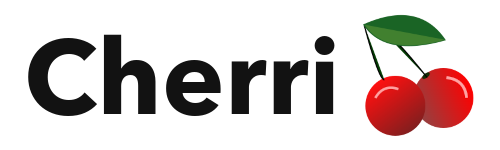

<p align="center">
   
</p>

# Cherri

[](https://github.com/electrikmilk/cherri/actions/workflows/go.yml) [](https://github.com/electrikmilk/cherri/releases) [](https://github.com/electrikmilk/cherri/blob/main/go.mod) [](https://github.com/electrikmilk/cherri/blob/main/LICENSE)

**Cherri** (pronounced cherry) is a [iOS Siri Shortcuts](https://apps.apple.com/us/app/shortcuts/id915249334)
programming language, that compiles directly to a valid runnable Shortcut.

[Documentation](https://electrikmilk.github.io/cherri/)

[`hello-world.cherri`](examples/hello-world.cherri)

```
#define color yellow
#define glyph smiley
#define name Hello, Cherri!

@message = "Hello, Cherri!"
alert(message, "Alert", false)
```

This project is in the early stages of development, but it does have an [_
idealistic_ roadmap](https://github.com/electrikmilk/cherri/wiki/Project-Roadmap).

### Usage

```bash
cherri file.cherri
```

Run `cherri` without any arguments to see all options and usage. For development, use the `--debug` (or `-d`) option for
stack traces and create a plist file.

## Why macOS only?

Generating valid Shortcuts is only possible on macOS. I am planning to make a web editor once the compiler matures a
little more that will turn out valid Shortcuts.

### Development on other platforms

As it stands, I don't want someone to get confused and think Shortcuts compiled using Cherri on other platforms will run
on their Mac or iOS device. However, you can build the compiler for your platform and use the `--unsigned` (or `-u` for
short) to skip signing the compiled Shortcut, but the compiled Shortcut will not run on iOS or macOS, obviously. The
compiler currently only supports Unix-like systems.

[Read my full thoughts on this](https://github.com/electrikmilk/cherri/wiki/Why-macOS-only%3F)

## Why another Shortcuts language?

1. Because it's fun :)
2. Some languages have been abandoned, don't work very well, or no longer work.
3. I don't want Shortcuts languages to die. There should be more, not less.
4. Some stability that comes with the project being on macOS and not iOS.
5. I am not aware of any project [other than one](https://github.com/zachary7829/Buttermilk) that compiles a
   Shortcut in a way that is meant for a desktop OS.

## Credits

### Reference

- [zachary7829](https://github.com/zachary7829)'
  s [Shortcut File Format Reference](https://zachary7829.github.io/blog/shortcuts/fileformat)
- [sebj](https://github.com/sebj)'s [Shortcut File Format Reference](https://github.com/sebj/iOS-Shortcuts-Reference)

### Inspiration

- Go syntax
- Ruby syntax
- [ScPL](https://github.com/pfgithub/scpl)
- [Buttermilk](https://github.com/zachary7829/Buttermilk)
- [Jelly](https://jellycuts.com)

---

_The original Workflow app assigned a code name to each release. Cherri is named after the second to last
update "Cherries" (also cherry is one of my favorite flavors)._
