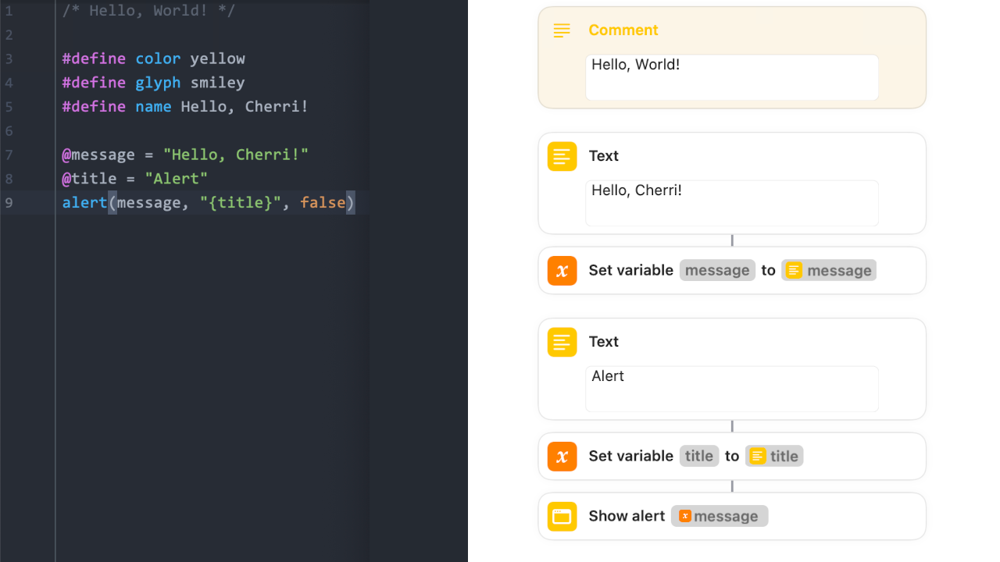

**Cherri** (pronounced cherry) is a [iOS Siri Shortcuts](https://apps.apple.com/us/app/shortcuts/id915249334) programming language, that compiles directly to a valid runnable Shortcut.

## Documentation

- [Getting started with Cherri](language/index.md)
- [Learn how to contribute to Cherri](compiler/index.md)
